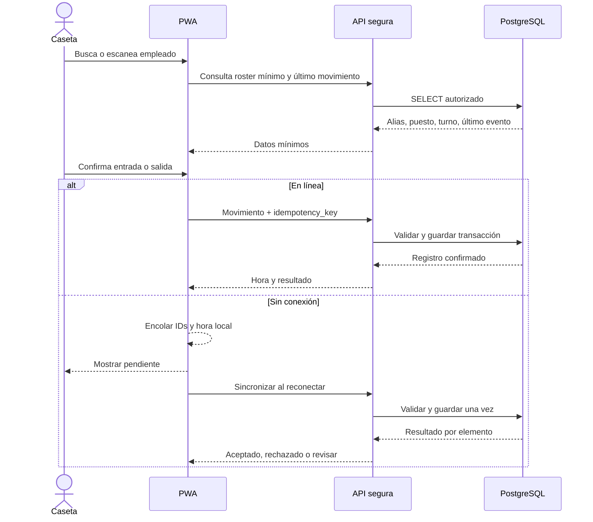
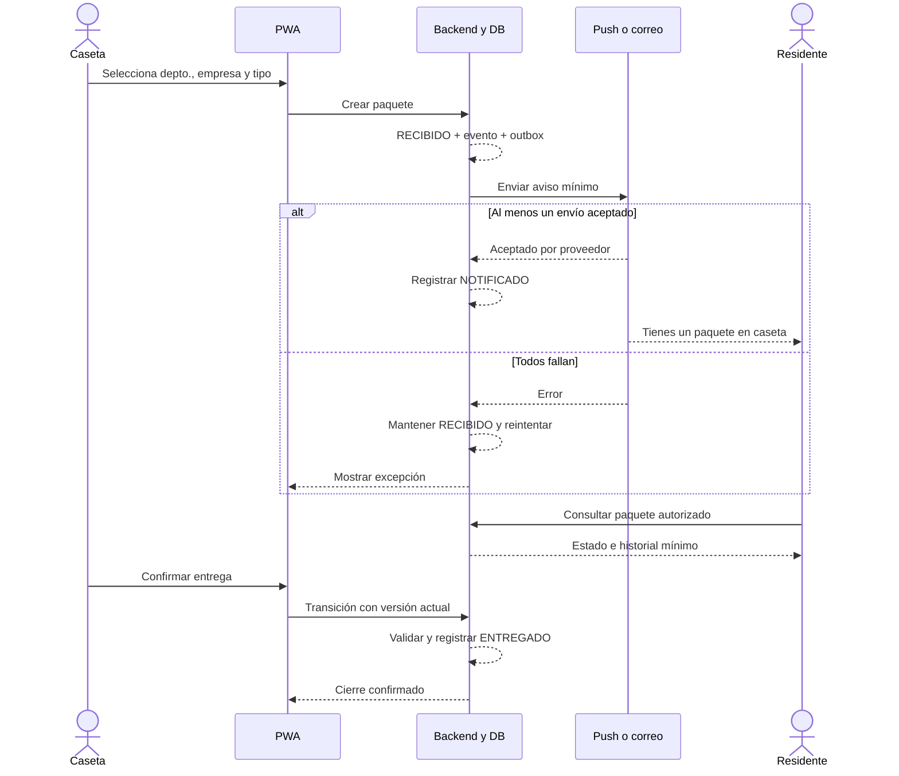
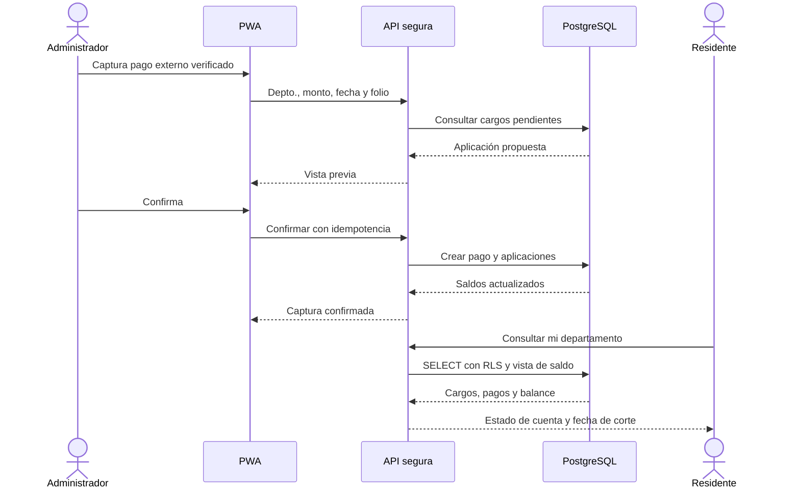
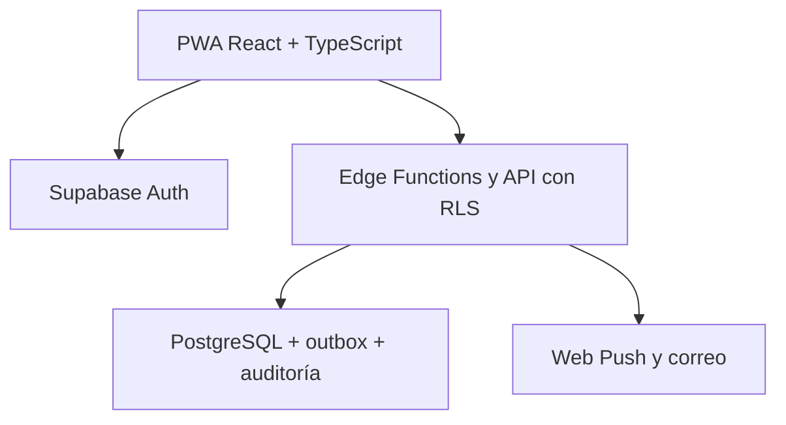

# Design doc — MVP de administración de condominio

| Campo | Valor |
|---|---|
| Estado | Propuesta para validación con administración |
| Alcance | Un condominio de 54 departamentos en México |
| Capacidad objetivo | Hasta 150 usuarios registrados |
| Fecha | 20 de julio de 2026 |
| Rama | `Sol_MANT` |
| Propietarios del documento | Producto, ingeniería y administración del condominio |

> Este documento es una especificación de producto y tecnología, no una opinión legal. Los apartados de privacidad deben ser revisados por la persona asesora jurídica de la administración antes del lanzamiento.

## Supuestos explícitos

Los siguientes supuestos permiten proponer un MVP sin bloquear el diseño. Cada uno debe confirmarse en la sección 12.

- **SUP-01 — Un solo condominio.** La primera versión opera únicamente los 54 departamentos indicados; no se incluye una entidad `condominio` ni arquitectura multi-tenant.
- **SUP-02 — Zona horaria y moneda.** La operación se muestra en `America/Mexico_City` y los importes están en MXN. La base de datos conserva fechas y horas en UTC.
- **SUP-03 — Responsable de los datos.** La persona moral, asociación o administración que legalmente opera el condominio será el “responsable” conforme a la LFPDPPP; su razón social, domicilio y canal ARCO están pendientes.
- **SUP-04 — Acceso por invitación.** No habrá registro público. El administrador invita un correo previamente autorizado y lo vincula a uno o más departamentos y a un rol.
- **SUP-05 — Residentes autorizados.** Todo usuario con asignación vigente al rol `RESIDENTE` puede ver paquetes y estado de cuenta del departamento asignado. Debe confirmarse si los inquilinos pueden ver adeudos o si se requiere distinguir `PROPIETARIO` e `INQUILINO`.
- **SUP-06 — Cuentas individuales.** Administradores y operadores de caseta usan cuentas personales; no se permiten cuentas compartidas, aunque el dispositivo físico sí pueda ser compartido.
- **SUP-07 — Cobro externo.** Los pagos ocurren fuera de la aplicación —transferencia, depósito u otro medio administrado por el condominio—. La aplicación únicamente registra el pago ya verificado; no solicita ni guarda tarjeta, CLABE, cuenta bancaria o comprobante.
- **SUP-08 — Identificación mínima de empleados.** Se usa un alias operativo único y, opcionalmente, una credencial QR/PIN aleatoria. No se recaban biometría, CURP, RFC, domicilio, teléfono, identificación oficial ni fotografía.
- **SUP-09 — Paquetería mínima.** Se registra departamento, empresa, tipo genérico y estado. No se guarda guía, remitente, contenido, fotografía, firma ni identificación de quien recoge.
- **SUP-10 — Conectividad intermitente.** Caseta dispone de un teléfono, tableta o computadora moderna, pero puede perder conexión temporalmente. Los registros críticos requieren una cola local acotada.
- **SUP-11 — Volumen.** El volumen mensual esperado cabe holgadamente en una base PostgreSQL pequeña y en los planes iniciales de correo/push; no se optimiza para miles de condominios.
- **SUP-12 — Modelo lógico extensible.** El ER proporcionado es la fuente de verdad inicial, pero acepta las columnas y tablas auxiliares mínimas señaladas en la sección 6 para auditoría, transiciones, notificación, privacidad e idempotencia.

## 1. Resumen ejecutivo y objetivos

### 1.1 Problema

La administración necesita reemplazar registros dispersos de caseta, avisos informales de paquetes y consultas manuales de mantenimiento por una aplicación pequeña, trazable y fácil de operar. El MVP concentra cuatro capacidades:

1. autenticación por correo y vinculación controlada usuario–departamento;
2. entradas y salidas de empleados desde caseta;
3. paquetes con ciclo `RECIBIDO → NOTIFICADO → ENTREGADO`;
4. estado de cuenta de mantenimiento, con pagos capturados manualmente por administración.

La solución prioriza operación confiable, bajo costo y minimización de datos por encima de personalización avanzada o automatización contable.

### 1.2 Objetivos de producto

- Dar a cada residente acceso autoservicio únicamente a la información de sus departamentos.
- Reducir el tiempo y la ambigüedad al registrar movimientos de empleados y paquetes.
- Asegurar que cada paquete tenga historial de recepción, envío del aviso y entrega.
- Proveer un saldo de mantenimiento explicable a partir de cargos, pagos y aplicaciones.
- Dejar una bitácora de quién realizó cada acción administrativa sin recabar datos innecesarios.
- Lanzar con un aviso de privacidad integral y uno simplificado, un canal ARCO y reglas automáticas de retención.

### 1.3 No objetivos del MVP

Quedan expresamente fuera del MVP: medición/cobro de gas o agua, reserva de amenidades, incidencias, visitas con QR, votaciones, avisos generales, pasarela de pagos, facturación, carga de comprobantes, chat, biometría e identificaciones oficiales. Se ubican en el roadmap de la sección 11.

### 1.4 Métricas de éxito

Las métricas se calculan con eventos agregados y sin herramientas de analítica que copien PII a un tercero.

| Objetivo | Indicador y definición | Meta |
|---|---|---|
| Adopción | Departamento activo: tiene al menos una asignación vigente y un inicio de sesión en los últimos 30 días | Al menos 38 de 54 departamentos (70%) al cierre del mes 3 |
| Uso recurrente | Departamentos activos mensuales | Al menos 33 de 54 (60%) en el mes 3 |
| Paquetería | Paquetes creados en línea cuyo aviso fue aceptado por al menos un canal; p95 desde recepción hasta `NOTIFICADO` | 95% en ≤5 minutos |
| Cierre de paquetes | Paquetes entregados que cuentan con los tres eventos válidos y ordenados | ≥98% |
| Registro de empleados | Movimientos capturados digitalmente contra una muestra semanal del rol físico/operativo | ≥95% desde el mes 2 |
| Calidad de accesos | Registros anulados/corregidos por error de captura | <2% mensual |
| Mantenimiento | Departamentos con cargo mensual generado y saldo consultable a más tardar el día hábil acordado | 100% cada mes |
| Oportunidad de pagos | Pagos externos verificados que se capturan en el sistema | 95% dentro de 2 días hábiles |
| Privacidad | Usuarios activos a quienes se mostró la versión vigente del aviso y empleados cubiertos por aviso en caseta | 100% antes del lanzamiento general |
| Datos prohibidos | Campos, archivos o notas con biometría, datos sensibles, identificaciones oficiales o datos de pago | 0 |

**Instrumentación mínima:** contadores por estado y marca de tiempo; no se registra contenido de pantalla, pulsaciones, ubicación, dirección IP de largo plazo ni identificadores publicitarios. Un tablero administrativo mensual mostrará únicamente agregados y excepciones operativas.

## 2. Usuarios, roles y permisos

### 2.1 Roles

- **Administrador:** configura catálogos y cuotas, invita/revoca usuarios, captura pagos, consulta bitácoras y corrige mediante anulaciones auditadas.
- **Caseta:** registra entradas/salidas y opera paquetes. No puede ver correos de residentes ni información de mantenimiento.
- **Residente:** consulta paquetes y estado de cuenta exclusivamente de sus departamentos con asignación vigente.
- **Empleado del condominio:** es sujeto de un registro operativo, pero no es usuario autenticado del MVP.

Una persona puede tener más de una asignación vigente. Sus permisos efectivos son la unión de roles vigentes, siempre limitados al departamento cuando la acción es departamental. Una asignación vencida deja de autorizar en la siguiente solicitud, no solo al cerrar sesión.

### 2.2 Matriz rol × acción

| Acción | Administrador | Caseta | Residente | Empleado |
|---|:---:|:---:|:---:|:---:|
| Autenticarse y cerrar su sesión | Sí | Sí | Sí | No aplica |
| Ver/editar su alias y preferencias de notificación | Sí, propias | Sí, propias | Sí, propias | No |
| Consultar sus departamentos vinculados | Sí | No aplica | Sí | No |
| Invitar, vincular, revocar o cambiar roles | Sí | No | No | No |
| Ver correos de usuarios | Sí, solo para administración de acceso | No | Solo el propio | No |
| Gestionar puestos, turnos y empleados | Sí | Solo consulta del roster mínimo | No | No |
| Registrar entrada o salida | Sí | Sí | No | No |
| Ver bitácora de accesos | Sí, completa | Últimas 24 h necesarias para operar | No | No en app; acceso vía ARCO |
| Anular/corregir un movimiento | Sí, con motivo | No | No | No |
| Gestionar empresas/tipos de paquetería | Sí | Solo seleccionar | No | No |
| Dar de alta un paquete | Sí | Sí | No | No |
| Reintentar o registrar aviso manual | Sí | Sí | No | No |
| Marcar paquete entregado | Sí | Sí | No | No |
| Consultar paquetes | Todos | Todos los pendientes; histórico operativo limitado | Solo los de sus departamentos | No |
| Configurar cuota y generar cargos | Sí | No | No | No |
| Capturar/anular pago y aplicar saldo | Sí | No | No | No |
| Consultar estado de cuenta | Todos los departamentos | No | Solo sus departamentos | No |
| Exportar datos masivos | No en MVP | No | No | No |
| Consultar auditoría de acciones | Sí | Solo sus acciones recientes | No | No |
| Administrar aviso de privacidad/retención | Sí, con control de cambio | No | Consultar y ejercer ARCO | Consultar aviso físico/digital y ejercer ARCO |

### 2.3 Reglas de autorización

- Toda lectura y escritura se valida en servidor y con Row Level Security (RLS); ocultar un botón no constituye autorización.
- Caseta opera con identificadores de departamento y alias de empleado; nunca recibe el correo del residente.
- El residente puede consultar una fila departamental solo si existe `asignacion_rol_usuario` vigente al momento de la consulta.
- Operaciones monetarias, cambios de rol, anulaciones y cambios de privacidad requieren rol administrador y reautenticación reciente.
- El rol se obtiene de la base de datos, no de metadatos editables del navegador.
- No se comparten cuentas. Toda mutación conserva `usuario_id` del actor y hora del servidor.

## 3. Historias de usuario y criterios de aceptación

### 3.1 Autenticación y vinculación

#### AUTH-01 — Invitar y vincular a un usuario

**Historia.** Como administrador, quiero invitar un correo y vincularlo a un departamento/rol para controlar quién accede a la información.

- **Given** un departamento activo y un correo que aún no tiene una asignación equivalente vigente, **When** el administrador confirma la invitación, **Then** el sistema crea o reutiliza al usuario en estado pendiente, crea la asignación y envía un enlace de un solo uso.
- **Given** un correo ya vinculado al mismo departamento y rol, **When** se repite la operación, **Then** la respuesta es idempotente y no crea una asignación duplicada.
- **Given** un correo con formato inválido o un departamento inactivo, **When** se intenta invitar, **Then** no se escribe ningún dato y se explica el error sin revelar otras cuentas.
- **Given** una invitación, **When** se muestra la confirmación al administrador, **Then** el correo aparece parcialmente enmascarado y el evento queda auditado.

#### AUTH-02 — Iniciar sesión por correo

**Historia.** Como usuario invitado, quiero iniciar sesión sin contraseña para evitar credenciales compartidas o reutilizadas.

- **Given** un correo invitado y vigente, **When** solicita acceso, **Then** recibe un enlace mágico/OTP de un solo uso con expiración máxima de 10 minutos.
- **Given** un enlace válido, **When** el usuario lo utiliza, **Then** se verifica el correo, se inicia una sesión y se muestran únicamente sus módulos autorizados.
- **Given** un correo no invitado, **When** solicita acceso, **Then** la interfaz responde de forma genérica y no crea acceso de dominio.
- **Given** intentos repetidos, **When** exceden el límite configurado, **Then** se aplica rate limiting y se registra un evento de seguridad sin retener la IP más del periodo definido.

#### AUTH-03 — Mostrar aviso de privacidad

**Historia.** Como titular, quiero conocer el uso de mis datos antes de usar la aplicación.

- **Given** una primera autenticación o una nueva versión material del aviso, **When** el usuario entra, **Then** se muestra el aviso simplificado, un enlace al integral y las finalidades necesarias.
- **Given** que el usuario continúa, **When** confirma que recibió el aviso, **Then** se registra versión, fecha y usuario; este acuse no se presenta engañosamente como consentimiento para finalidades opcionales.
- **Given** que las finalidades necesarias no son aceptables para el usuario, **When** solicita no usar la app, **Then** puede salir y contactar a administración/ARCO sin que se habiliten finalidades adicionales.

#### AUTH-04 — Revocar acceso

**Historia.** Como administrador, quiero terminar una vinculación cuando una persona deja el departamento.

- **Given** una asignación vigente, **When** el administrador indica fecha de terminación, **Then** se establece `vigente_hasta`, se revocan las sesiones afectadas y el acceso cesa en la siguiente solicitud.
- **Given** que el mismo usuario conserva otra asignación, **When** se revoca solo una, **Then** mantiene únicamente los permisos de las asignaciones restantes.
- **Given** una revocación, **When** se consulta auditoría, **Then** aparecen actor, fecha y asignación; no se guarda una nota libre con datos personales.

### 3.2 Entradas y salidas de empleados

#### EMP-01 — Mantener roster mínimo

**Historia.** Como administrador, quiero gestionar empleados por alias, puesto y turno para que caseta pueda identificarlos sin datos excesivos.

- **Given** un puesto y turno válidos, **When** se crea un empleado, **Then** solo se exige alias operativo único, puesto, turno y estado activo.
- **Given** un empleado inactivo, **When** caseta busca para registrar un movimiento, **Then** no aparece en resultados ordinarios, pero su historial previo se conserva según retención.
- **Given** un intento de capturar nombre legal, identificación, fotografía, teléfono o dato sensible, **When** se usa el formulario, **Then** no existe campo ni carga de archivo para hacerlo.

#### EMP-02 — Registrar entrada/salida en línea

**Historia.** Como operador de caseta, quiero registrar un movimiento en pocos pasos para no retrasar el acceso.

- **Given** una sesión de caseta vigente y un empleado activo, **When** selecciona `ENTRADA` o `SALIDA` y confirma, **Then** el servidor registra empleado, puesto y turno históricos, actor, hora de ocurrencia y hora de captura.
- **Given** que el último movimiento válido es del mismo tipo, **When** se intenta repetirlo, **Then** se muestra advertencia y no se duplica; solo un administrador puede resolver la inconsistencia.
- **Given** doble clic o reintento de red con la misma llave de idempotencia, **When** llega al servidor, **Then** existe un solo registro.
- **Given** una operación exitosa, **When** responde el servidor, **Then** la interfaz muestra alias, movimiento y hora con confirmación visible y no depende solo del color.

#### EMP-03 — Operar con conectividad intermitente

**Historia.** Como caseta, quiero continuar capturando movimientos durante una caída corta de internet.

- **Given** una sesión previamente validada y roster mínimo en caché, **When** no hay red, **Then** la PWA permite encolar el movimiento con UUID de idempotencia y hora del dispositivo, marcado como “pendiente de sincronizar”.
- **Given** que vuelve la red dentro de 24 horas, **When** se sincroniza, **Then** el servidor conserva hora del cliente y hora de recepción, valida duplicados y devuelve el resultado de cada elemento.
- **Given** una cola pendiente, **When** se cierra sesión o vence el plazo local, **Then** se advierte al operador antes de purgar; tras una sincronización exitosa, el registro local se elimina.
- **Given** un desfase de reloj mayor al umbral configurado, **When** sincroniza, **Then** el registro queda marcado para revisión sin alterar silenciosamente la hora informada.

#### EMP-04 — Corregir sin borrar

**Historia.** Como administrador, quiero anular un error con motivo para conservar trazabilidad.

- **Given** un movimiento válido incorrecto, **When** el administrador lo anula y selecciona un motivo estructurado, **Then** el original no se elimina, deja de contar para el estado actual y se registra actor/fecha.
- **Given** una anulación, **When** se consulta el historial, **Then** se distingue visualmente del movimiento válido y se muestra el motivo sin notas libres extensas.

### 3.3 Paquetería

#### PAQ-01 — Recibir un paquete

**Historia.** Como caseta, quiero registrar un paquete con pocos datos y disparar su aviso.

- **Given** un departamento activo, **When** caseta selecciona departamento, empresa y tipo genérico, **Then** se crea el paquete en `RECIBIDO`, su evento inicial y un trabajo de notificación en una misma transacción.
- **Given** que no hay usuario activo vinculado, **When** se confirma, **Then** el paquete se conserva en `RECIBIDO` y aparece “sin destinatario digital”; no se solicita teléfono ni otro dato alterno.
- **Given** una captura duplicada con la misma llave de idempotencia, **When** se reintenta, **Then** no se crea un segundo paquete.
- **Given** una caída de red, **When** caseta confirma el alta, **Then** la PWA la encola y advierte “aún no notificado”; al reconectar crea paquete/evento/outbox una sola vez y dispara el aviso.

#### PAQ-02 — Notificar y avanzar el estado

**Historia.** Como residente, quiero recibir un aviso oportuno cuando caseta registra un paquete.

- **Given** al menos una suscripción push o correo activo, **When** el trabajador procesa el outbox, **Then** intenta push y correo según preferencias y registra solo metadatos mínimos del intento.
- **Given** que al menos un proveedor acepta el envío, **When** se confirma la aceptación, **Then** se agrega el evento `NOTIFICADO` y se actualiza el estado actual.
- **Given** que todos los canales fallan, **When** termina el intento, **Then** el paquete permanece `RECIBIDO`, se programa reintento con backoff y caseta ve una alerta accionable.
- **Given** el estado `NOTIFICADO`, **When** se muestra al operador, **Then** la interfaz aclara que significa “aviso aceptado para envío”, no “mensaje leído”.
- **Given** un aviso por pantalla bloqueada, **When** se construye el mensaje, **Then** no incluye número de departamento, nombre, guía ni contenido: “Tienes un paquete en caseta”.

#### PAQ-03 — Aviso manual controlado

**Historia.** Como caseta, quiero registrar un aviso manual cuando no hay canal digital.

- **Given** un paquete `RECIBIDO` sin canal exitoso, **When** caseta confirma que avisó por un método operativo permitido, **Then** se registra `NOTIFICADO` con canal `MANUAL`, actor y hora.
- **Given** esa acción, **When** se confirma, **Then** no existe campo para escribir teléfono, nombre o una conversación.

#### PAQ-04 — Entregar un paquete

**Historia.** Como caseta, quiero cerrar la custodia del paquete sin almacenar una identificación.

- **Given** un paquete `NOTIFICADO`, **When** caseta confirma la entrega, **Then** se agrega `ENTREGADO` con actor y hora y desaparece de pendientes.
- **Given** un paquete `RECIBIDO`, **When** se intenta entregar, **Then** el sistema exige completar primero el evento `NOTIFICADO` digital o manual.
- **Given** dos operadores intentando entregar a la vez, **When** confirman, **Then** un bloqueo/versión optimista admite una transición y la otra recibe “ya entregado”.
- **Given** la entrega, **When** se abre el formulario, **Then** no se solicita firma, foto, nombre legal ni identificación oficial.

#### PAQ-05 — Consultar paquetes propios

**Historia.** Como residente, quiero ver el estado de paquetes de mi departamento.

- **Given** una asignación vigente, **When** abre paquetería, **Then** ve únicamente paquetes de sus departamentos dentro de la ventana de retención.
- **Given** que intenta acceder por URL a otro `paquete_id`, **When** el servidor evalúa RLS, **Then** no devuelve la fila ni confirma su existencia.

### 3.4 Mantenimiento

#### MANT-01 — Configurar y generar cargos

**Historia.** Como administrador, quiero definir la cuota vigente y generar cargos mensuales consistentes.

- **Given** una configuración vigente por departamento, **When** se ejecuta la generación del periodo, **Then** se crea un cargo `MANTENIMIENTO` con periodo, vencimiento y monto.
- **Given** que el cargo del mismo departamento/concepto/periodo ya existe, **When** se reintenta, **Then** la operación es idempotente y no duplica el adeudo.
- **Given** que cambia una cuota, **When** se captura una nueva vigencia, **Then** no se reescriben cargos históricos.

#### MANT-02 — Capturar un pago externo

**Historia.** Como administrador, quiero registrar un pago ya verificado para actualizar el saldo.

- **Given** un pago recibido fuera de la app, **When** el administrador captura departamento, monto, fecha efectiva y folio interno y revisa la vista previa, **Then** se crea el pago y sus aplicaciones en una transacción.
- **Given** cargos pendientes, **When** no se elige una aplicación específica, **Then** se aplica primero al cargo de mantenimiento vencido más antiguo y se muestra el resultado antes de confirmar.
- **Given** un folio ya existente, monto no positivo o fecha inválida, **When** se confirma, **Then** no se escribe nada y se muestra el conflicto.
- **Given** que el pago excede los cargos, **When** se registra, **Then** la diferencia aparece como saldo a favor no aplicado; nunca se procesa una devolución desde la app.
- **Given** la pantalla de captura, **When** el administrador opera, **Then** no existen campos para tarjeta, banco, cuenta, CLABE, comprobante o nota libre con datos financieros.

#### MANT-03 — Corregir un pago

**Historia.** Como administrador, quiero anular una captura errónea sin borrar el historial.

- **Given** un pago capturado por error, **When** se anula con motivo estructurado, **Then** sus aplicaciones dejan de afectar saldos, el pago original permanece auditado y no se reutiliza el folio.
- **Given** un periodo cerrado definido por administración, **When** se intenta anular, **Then** se exige reautenticación y confirmación adicional o se bloquea según la política acordada.

#### MANT-04 — Consultar estado de cuenta

**Historia.** Como residente, quiero entender cuánto debo y cómo se calculó.

- **Given** una asignación vigente, **When** abre su estado de cuenta, **Then** ve saldo neto, adeudo, saldo a favor, fecha de corte y movimientos ordenados.
- **Given** cada cargo, **When** se despliega, **Then** muestra concepto, periodo, vencimiento, monto, aplicado y pendiente.
- **Given** cada pago, **When** se despliega, **Then** muestra fecha, folio interno parcialmente enmascarado, monto y aplicación; no presenta datos bancarios.
- **Given** un usuario con dos departamentos, **When** cambia el selector, **Then** los saldos no se mezclan y cada consulta vuelve a validar autorización.
- **Given** que no existen movimientos, **When** abre la pantalla, **Then** se muestra estado vacío y fecha de actualización, no un saldo inferido engañoso.

## 4. Flujos principales

### 4.1 Registro de entrada/salida de empleado en caseta

1. El operador inicia sesión con su correo individual; la PWA carga únicamente el roster mínimo de empleados activos.
2. Busca por alias/puesto o escanea una credencial opaca. El valor crudo de la credencial no se almacena.
3. La PWA muestra alias, puesto, turno y el último movimiento válido.
4. El operador elige `ENTRADA` o `SALIDA` y confirma.
5. En línea, la API valida rol, empleado activo, secuencia e idempotencia; guarda puesto/turno históricos, actor y horas.
6. Sin conexión, la PWA encola IDs, movimiento, hora local y UUID; muestra el elemento como pendiente. No guarda correos ni catálogos financieros.
7. Al reconectar, sincroniza en orden. La API acepta, rechaza o marca para revisión cada registro; la PWA elimina solo los aceptados.
8. El panel muestra confirmación accesible. Una corrección posterior es una anulación administrativa, nunca un `DELETE`.

### 4.2 Alta de paquete, notificación y entrega

1. Caseta selecciona departamento, empresa de paquetería y tipo genérico.
2. La API crea `paquete(RECIBIDO)`, el evento `RECIBIDO` y una fila de outbox en una transacción.
3. El trabajador obtiene únicamente los destinatarios con asignación vigente y sus canales activos; caseta nunca recibe esos correos/endpoints.
4. Se intenta Web Push y, como respaldo, correo. El texto no expone departamento ni contenido en el asunto/pantalla bloqueada.
5. Al aceptar un proveedor al menos un envío, la API registra `NOTIFICADO`. Si todos fallan, reintenta y mantiene `RECIBIDO` visible como excepción.
6. El residente puede abrir la aplicación y ver el detalle autorizado. La apertura no es requisito para cambiar el estado.
7. Al recogerlo, caseta marca `ENTREGADO`; la API valida que el estado anterior sea `NOTIFICADO` y usa control de concurrencia.
8. No se captura quién recogió, firma, foto o identificación. La verificación física, si existe, es un procedimiento fuera de la app.

### 4.3 Captura de pago y consulta del estado de cuenta

1. Administración define la cuota vigente y genera cargos mensuales idempotentes para los 54 departamentos.
2. El pago sucede por un canal externo. Tras verificarlo, el administrador captura departamento, monto, fecha y folio interno.
3. La API presenta la aplicación propuesta —por defecto al cargo vencido más antiguo— y no guarda hasta la confirmación.
4. En una transacción se crean `pago_departamento` y `aplicacion_pago`; cualquier remanente queda como saldo a favor.
5. El residente se autentica, selecciona uno de sus departamentos y solicita el estado de cuenta.
6. RLS valida la asignación vigente. Una vista calcula cargos pendientes, pagos, aplicaciones, saldo a favor y saldo neto.
7. La pantalla muestra fecha de corte y movimientos explicables. No ofrece botón para pagar ni cargar comprobantes.
8. Una corrección anula el pago y sus efectos con auditoría; no modifica o elimina el original.

## 5. Arquitectura propuesta

### 5.1 Decisión de stack

| Capa | Propuesta | Justificación para este MVP |
|---|---|---|
| Cliente | React + TypeScript + Vite, PWA responsiva | Una base de código para móvil/escritorio, instalación opcional y soporte de cola offline; evita tiendas de aplicaciones |
| UI | CSS utilitario o sistema pequeño de componentes accesibles | Velocidad para equipo pequeño sin crear un design system extenso |
| Hosting web | Cloudflare Pages, contenido estático | HTTPS, CDN, despliegues por rama y solicitudes de assets sin costo; no aloja datos de negocio |
| Backend | Supabase administrado | Reúne Auth, PostgreSQL, RLS, APIs y Edge Functions con poca carga operativa |
| Base de datos | PostgreSQL | Encaja con el modelo relacional, transacciones de cargos/pagos, restricciones y vistas explicables |
| Autenticación | Supabase Auth por enlace mágico/OTP de correo, registro público deshabilitado | Satisface autenticación simple y evita almacenar contraseñas en el modelo de dominio |
| Lógica de escritura | Edge Functions/RPC transaccionales | Centraliza autorización, idempotencia, transiciones y auditoría; la `service_role` nunca llega al navegador |
| Lecturas | API de datos con RLS y vistas seguras | Menos backend personalizado sin sacrificar aislamiento por departamento |
| Notificaciones | Web Push con VAPID + correo transaccional | Push oportuno con costo marginal nulo y correo como respaldo universal |
| Observabilidad | Logs estructurados sin PII + monitoreo de disponibilidad/errores | Diagnóstico suficiente sin copiar información de residentes a analítica de terceros |

No se propone Kubernetes, microservicios, aplicación nativa ni una cola dedicada. Para 150 usuarios añadirían costo y operación sin beneficio material. El outbox vive en PostgreSQL y un trabajo programado de Edge Functions procesa reintentos.

### 5.2 Límites y decisiones técnicas

- `auth.users.id` y `usuario.usuario_id` deben compartir UUID o tener una relación 1:1 explícita. El esquema de autenticación administrado no guarda datos de negocio.
- La invitación cruza Auth y la base de dominio, por lo que usa un flujo idempotente: deja el usuario en `PENDIENTE`, solicita la invitación al proveedor y activa el acceso solo cuando ambas partes existen; un reintento repara el paso faltante.
- Las mutaciones críticas son funciones transaccionales: `registrar_movimiento_empleado`, `crear_paquete`, `transicionar_paquete`, `capturar_pago`, `anular_pago` e `invitar_usuario`.
- Fechas de servidor se guardan con `timestamptz`; la hora del dispositivo se conserva separada únicamente para capturas offline.
- Montos usan `numeric(12,2)`, moneda implícita MXN para este condominio y restricciones `CHECK monto > 0` donde aplique.
- Las credenciales operativas de empleados son valores aleatorios. Se guarda un HMAC con secreto del servidor —no un hash simple de PIN corto— y nunca el valor original.
- RLS se prueba con casos negativos: otro departamento, asignación vencida, rol incorrecto y acceso directo por UUID.
- Cada escritura acepta `idempotency_key` único por actor/tipo para tolerar doble clic, reintentos de red y sincronización offline.
- La auditoría registra actor, acción, entidad, ID, resultado y hora; evita snapshots completos, correos y notas libres.

### 5.3 Notificaciones y alternativas de costo

**Flujo recomendado.** Al crear un paquete se escribe un evento en `notificacion_salida`. Un trabajador toma la fila con bloqueo, resuelve destinatarios vigentes, envía primero Web Push y después correo según preferencia/fallback, guarda código de resultado y reintenta errores temporales. Los endpoints push solo son legibles por el backend. Un endpoint vencido se elimina.

**Semántica:** `NOTIFICADO` significa que al menos un proveedor aceptó el mensaje o que caseta registró aviso manual. No significa entrega al dispositivo, lectura ni acuse del residente.

**Estimación a precios de lista verificados el 20-07-2026; confirmar al contratar:**

| Opción | Costo de plataforma estimado | Ventajas | Límites/decisión |
|---|---:|---|---|
| Piloto no productivo | US$0/mes: niveles gratuitos de Supabase, Pages y Resend | Permite pruebas | Sin compromiso de disponibilidad; respaldo/pausa y límites no adecuados como única estrategia de producción |
| **Producción lean recomendada** | Aproximadamente US$25/mes + dominio e impuestos: Supabase Pro; Pages y Resend Free mientras alcance | Supabase Pro incluye respaldos diarios; Resend Free ofrece 3,000 correos/mes y 100/día; volumen suficiente esperado | El lanzamiento masivo de invitaciones debe escalonarse o usar plan pagado; precios y tipo de cambio pueden variar |
| Correo con holgura | Aproximadamente US$45/mes + dominio e impuestos: Supabase Pro + Resend Pro | 50,000 correos/mes y sin límite diario publicado | Probablemente innecesario para 54 departamentos |
| FCM en vez de Web Push directo | Sin costo por Cloud Messaging publicado | SDK y gestión de tokens madura | Añade proveedor y tratamiento de identificadores; no sustituye correo y requiere evaluación contractual/privacidad |
| Solo correo | Mismo costo base; sin desarrollo push | Máxima compatibilidad y menor complejidad | Menor inmediatez, dependencia de entregabilidad y bandeja de spam |

Referencias de precio: [Supabase](https://supabase.com/pricing), [Cloudflare Pages](https://developers.cloudflare.com/pages/functions/pricing/), [Resend](https://resend.com/pricing) y [Firebase Cloud Messaging](https://firebase.google.com/products/cloud-messaging). No se deben prometer costos fijos en MXN sin cotización.

### 5.4 Seguridad operativa

- TLS en tránsito, cifrado administrado en reposo y secretos solo en el gestor del proveedor.
- SPF, DKIM y DMARC para el dominio de correo antes del piloto.
- Sesiones de caseta con bloqueo por inactividad y botón visible de cambio de operador.
- Reautenticación para roles, cuotas, pagos y anulaciones; alertas por cambios administrativos.
- Dependencias con actualizaciones automáticas controladas, análisis de vulnerabilidades y revisión mensual.
- Ambiente de prueba con datos sintéticos; nunca copiar producción completa a desarrollo.
- Plan de incidente: contener, preservar evidencia mínima, evaluar afectación y notificar de inmediato a titulares cuando la vulneración afecte significativamente sus derechos.

## 6. Modelo de datos

### 6.1 Tablas del modelo original usadas por el MVP

| Módulo | Tablas | Uso en MVP |
|---|---|---|
| Autenticación | `departamento`, `usuario`, `asignacion_rol_usuario` | Catálogo, perfil mínimo y autorización temporal por rol/departamento |
| Empleados | `puesto_empleado`, `turno_empleado`, `empleado_condominio`, `credencial_empleado`, `registro_acceso_empleado` | Roster mínimo, credencial opcional y eventos de entrada/salida |
| Paquetería | `empresa_paqueteria`, `paquete` | Catálogos y estado actual de cada paquete |
| Mantenimiento | `configuracion_cuota_mantenimiento`, `concepto_cargo`, `cargo_departamento`, `pago_departamento`, `aplicacion_pago` | Cuota vigente, cargos, pagos externos y su aplicación |

Para mantenimiento, `concepto_cargo.servicio_codigo` debe aceptar `NULL`; el concepto `MANTENIMIENTO` no corresponde a un servicio medido.

### 6.2 Tablas del modelo original fuera del MVP

| Grupo posterior | Tablas reservadas |
|---|---|
| Gas/agua medidos | `servicio_medido`, `suscripcion_servicio_departamento`, `medidor_servicio`, `lectura_medidor`, `tarifa_servicio`, `consumo_servicio` |
| Avisos generales | `aviso`, `aviso_departamento` |
| Incidencias | `area_comun`, `categoria_incidencia`, `incidencia_area_comun`, `foto_incidencia`, `historial_estado_incidencia` |
| Visitas QR | `visita_preautorizada`, `validacion_visita` |

Reserva de amenidades y votaciones no tienen tablas suficientes en el ER actual; se diseñarán cuando se apruebe su fase, evitando reutilizar entidades con semántica distinta.

### 6.3 Extensiones mínimas requeridas

El diagrama relaciona `usuario` con registros de acceso y paquetes, pero las entidades no incluyen las FKs que materializan esa auditoría. Además, el estado actual por sí solo no prueba el ciclo de paquetería. Se proponen estas extensiones antes de implementar:

| Cambio | Campos mínimos / propósito |
|---|---|
| `registro_acceso_empleado` | `registrado_por_usuario_id`, `registrado_en`, `idempotency_key`, `capturado_offline`, `hora_cliente`, `anulado_en`, `anulado_por_usuario_id`, `motivo_anulacion_codigo` |
| Nueva `historial_estado_paquete` | `evento_id`, `paquete_id`, `estado_nuevo`, `ocurrio_en`, `operado_por_usuario_id`, `canal_notificacion`, `idempotency_key`; evidencia la secuencia |
| `paquete` | `creado_en`, `actualizado_en`, `version`; el estado sigue siendo proyección actual para consultas rápidas |
| Nueva `notificacion_salida` | Outbox con `paquete_id`, canal, destinatario interno, estado, intentos, `proximo_intento_en`, código de error normalizado; no guarda cuerpo sensible |
| Nueva `suscripcion_notificacion` | `usuario_id`, canal, endpoint/token cifrado o protegido, estado, fecha de alta/último uso/expiración; sin nombre de dispositivo obligatorio |
| `cargo_departamento` | `periodo`, `vence_en`, `creado_en`, `creado_por_usuario_id`, `estado`; restricción única departamento + concepto + periodo |
| `pago_departamento` | `fecha_pago`, `capturado_en`, `capturado_por_usuario_id`, `estado`, `anulado_en`, `anulado_por_usuario_id`, `motivo_anulacion_codigo`, `idempotency_key` |
| `aplicacion_pago` | `creado_en`, `estado`; restricciones para que aplicaciones válidas no excedan pago ni cargo |
| Nuevas `version_aviso_privacidad` y `acuse_aviso_privacidad` | Publicación del texto/URL y registro de versión mostrada, usuario y fecha; separar acuse de cualquier consentimiento expreso |
| Nueva `evento_auditoria` | Actor, acción, tipo/ID de entidad, resultado, hora y correlación; sin duplicar valores personales o monetarios completos |

**Nota de minimización:** si el proveedor de correo exige guardar destinatario en su log, la aplicación conservará solo un identificador interno y código del proveedor; el correo completo se obtiene al momento de envío y no se copia a la bitácora.

### 6.4 Invariantes y vistas

- `asignacion_rol_usuario`: no admite intervalos inválidos; índice parcial para evitar duplicado vigente del mismo usuario/departamento/rol.
- `asignacion_rol_usuario`: `RESIDENTE` exige `departamento_id`; los roles globales `ADMINISTRADOR` y `CASETA` lo dejan en `NULL` y no heredan acceso departamental por accidente.
- `registro_acceso_empleado`: eventos append-only; anulaciones excluidas al calcular último movimiento.
- `paquete`: transiciones permitidas únicamente `RECIBIDO → NOTIFICADO → ENTREGADO`; cualquier corrección es evento auditado, no edición retroactiva.
- `aplicacion_pago`: suma válida por pago ≤ monto del pago y suma válida por cargo ≤ monto del cargo, bajo bloqueo transaccional.
- Vista `estado_cuenta_departamento`: presenta cargos pendientes, pagos no aplicados, adeudo, saldo a favor y saldo neto. El saldo no se almacena como una cifra editable.
- Vista `paquetes_pendientes_caseta`: solo `RECIBIDO`/`NOTIFICADO`, sin correos ni destinatarios.
- Todas las FKs e índices deben acompañar filtros de RLS por departamento y fechas de operación.

## 7. Diseño de pantallas — wireframe textual

### 7.1 Pantallas comunes

**1. Acceso por correo**

- Contenido: logotipo/nombre, campo correo, botón “Enviar enlace”, estado de envío, ayuda y enlace al aviso integral.
- Acciones: solicitar enlace; volver a enviar después del cooldown; abrir privacidad/soporte.
- No contiene selector de departamento ni confirma si un correo existe.

**2. Aviso de privacidad**

- Contenido: responsable, categorías de datos, finalidades necesarias, prohibiciones explícitas, retención resumida, proveedores/canales, ARCO y enlace al texto integral versionado.
- Acciones: confirmar recepción, descargar/consultar aviso, salir, contactar privacidad.

**3. Perfil y sesión**

- Contenido: alias, correo parcialmente oculto, roles/departamentos, canales de notificación, versión de aviso, sesiones activas básicas.
- Acciones: editar alias, activar/desactivar push o correo cuando sea opcional, cerrar esta/todas las sesiones, abrir ARCO.

### 7.2 Residente

**4. Inicio residente**

- Contenido: selector de departamento si hay más de uno; tarjetas “Paquetes pendientes” y “Saldo de mantenimiento”; fecha de última actualización.
- Acciones: abrir paquetes o estado de cuenta. No muestra información de otros departamentos en notificaciones ni previsualizaciones.

**5. Mis paquetes**

- Contenido: lista por estado con empresa, tipo genérico y fechas; filtros `Pendientes`/`Entregados recientes`.
- Acciones: abrir detalle; no puede cambiar estados.

**6. Detalle de paquete**

- Contenido: estado actual, empresa, tipo y línea de tiempo recibido/notificado/entregado. Explica que “notificado” no equivale a leído.
- Acciones: volver; ajustar preferencia de notificación. Sin guía, foto, contenido o nombre del operador.

**7. Estado de cuenta**

- Contenido: saldo neto destacado, adeudo, saldo a favor, fecha de corte; lista de cargos y pagos; leyenda “La app no procesa pagos”.
- Acciones: cambiar departamento, expandir movimiento y contactar administración por discrepancia. No hay botón pagar, adjuntar ni exportar en MVP.

### 7.3 Caseta

**8. Inicio de caseta**

- Contenido: operador actual, reloj, conectividad/sincronización, botones grandes “Entrada/salida” y “Recibir paquete”, contadores de paquetes pendientes y avisos fallidos.
- Acciones: iniciar flujo, reintentar sincronización, cambiar operador/cerrar sesión.

**9. Registrar movimiento de empleado**

- Contenido: búsqueda/escáner, resultados con alias/puesto/turno, último movimiento, botones `Entrada` y `Salida`, confirmación.
- Acciones: buscar, escanear, confirmar, cancelar. En offline muestra banner persistente y número de pendientes.

**10. Movimientos recientes**

- Contenido: últimas 24 horas con estado sincronizado, alias, movimiento y hora; los anulados están identificados.
- Acciones: consultar detalle y reportar error a administración; caseta no edita/anula.

**11. Alta de paquete**

- Contenido: selector/buscador de departamento, empresa, tipo; resumen de privacidad “No captures guía, nombre ni contenido”.
- Acciones: crear; si offline, encolar con advertencia de que la notificación saldrá al reconectar.

**12. Paquetes pendientes**

- Contenido: tarjetas `RECIBIDO`/`NOTIFICADO`, antigüedad, empresa/tipo, estado de aviso y excepciones “sin usuario/canal”.
- Acciones: reintentar, registrar aviso manual, abrir detalle, marcar entregado cuando proceda.

### 7.4 Administrador

**13. Panel administrativo**

- Contenido: adopción por departamento, paquetes con excepción, cola offline pendiente, estado de cargos del mes y pagos recientes; todo en agregados.
- Acciones: navegar a una excepción; no incluye rankings de personas ni analítica de comportamiento.

**14. Usuarios y asignaciones**

- Contenido: correo enmascarado, alias, estado, roles, departamentos y vigencias.
- Acciones: invitar, reenviar, vincular, terminar asignación, revocar sesiones. Confirmación fuerte para cambios.

**15. Empleados, puestos y turnos**

- Contenido: roster con alias, puesto, turno y activo; catálogos.
- Acciones: alta/edición operativa, activar/desactivar, emitir/revocar credencial aleatoria. Sin carga de documentos/fotos.

**16. Bitácora de accesos**

- Contenido: filtros por fecha/empleado/movimiento, actor, hora del evento/servidor y bandera offline.
- Acciones: abrir, anular con motivo, crear movimiento correctivo. No exportar masivamente en MVP.

**17. Administración de paquetería**

- Contenido: todos los estados dentro de retención, fallas y reintentos; catálogos de empresa/tipo.
- Acciones: operar estados, reintentar, corregir mediante evento, activar/desactivar catálogos.

**18. Cuotas y generación mensual**

- Contenido: vigencias, monto por departamento, periodo a generar, previsualización de 54 cargos y conflictos.
- Acciones: crear nueva vigencia, generar idempotentemente y revisar resultado.

**19. Captura de pago**

- Contenido: departamento, monto, fecha, folio interno, cargos pendientes y aplicación propuesta.
- Acciones: redistribuir aplicación si se autoriza, confirmar, cancelar. Sin medio de pago o comprobante.

**20. Estado de cuenta administrativo**

- Contenido: selector de departamento, saldo y movimientos, indicadores de anomalía.
- Acciones: abrir cargo/pago, anular pago con reautenticación, contactar al residente fuera de la app.

**21. Privacidad, retención y auditoría**

- Contenido: aviso vigente, fecha de publicación, cobertura de acuses, última purga/respaldo/restauración, eventos administrativos.
- Acciones: publicar nueva versión mediante flujo controlado, consultar solicitudes ARCO, ejecutar/revisar purga. El texto legal no se edita de forma improvisada en producción.

## 8. Requisitos no funcionales

### 8.1 Disponibilidad, rendimiento y operación

- Objetivo de disponibilidad mensual: **99.5%** para autenticación, consulta y escrituras en línea, excluyendo mantenimiento anunciado. No se presenta como SLA contractual si el proveedor no lo respalda.
- P95 de lectura en línea: ≤2 s; P95 de confirmación de una escritura: ≤3 s bajo conectividad normal; alta de acceso en ≤5 s de interacción humana mediana.
- La PWA carga la interfaz básica y roster mínimo offline; acceso y paquetes pueden encolarse por hasta 24 horas. Estados de cuenta nunca se sirven desde una copia offline persistente.
- Monitoreo cada 5 minutos, alerta al responsable técnico y página de estado simple. Errores se correlacionan por ID sin incluir correo, alias o monto en mensajes externos.
- Mantenimiento anunciado fuera de horarios pico de caseta cuando sea posible.

### 8.2 Respaldo y recuperación

- Producción usa un plan con respaldo automático diario; objetivo **RPO 24 horas** y **RTO 8 horas**.
- Retención mínima propuesta del respaldo operativo: 7 días. Si se realiza exportación semanal adicional, será cifrada, separada, con máximo 4 semanas y borrado automático.
- Prueba de restauración trimestral a un ambiente aislado con acceso restringido; registrar fecha, duración y resultado, no el contenido restaurado.
- Los respaldos heredan controles de acceso y purga. Una cancelación ARCO desaparece de copias rotatorias al vencer su ventana; el aviso debe explicar ese plazo.
- No se usan hojas de cálculo personales como respaldo paralelo.

### 8.3 Retención y purga propuestas

Los plazos son supuestos de producto y requieren validación jurídica/contable. Una retención legal justificada prevalece y se documenta como bloqueo, no como uso ordinario.

| Dato | Retención propuesta | Acción al vencer |
|---|---|---|
| Sesiones y tokens | Según expiración; revocación inmediata al terminar rol | Eliminar/revocar |
| Logs técnicos con IP truncada | 30 días | Purga automática |
| Auditoría de seguridad/administración | 12 meses | Pseudonimizar o purgar salvo investigación |
| Acceso de empleados | 90 días | Purga; excepción con `legal_hold` autorizado y fecha fin |
| Cola offline local | Hasta sincronizar o 24 horas | Borrar del dispositivo |
| Paquete | 90 días después de `ENTREGADO` | Purgar paquete e historial operativo |
| Intentos de notificación | 30 días | Purgar metadatos; endpoints inválidos inmediatamente |
| Suscripción push inactiva | 30 días desde invalidación/cierre de cuenta | Eliminar token/endpoint |
| Perfil/correo de usuario | Mientras exista asignación vigente + 30 días, salvo obligación o solicitud ARCO anterior | Bloquear y después eliminar/pseudonimizar |
| Historial de asignación usuario–departamento | 24 meses tras finalizar | Pseudonimizar, salvo obligación/disputa |
| Cargos, pagos y aplicaciones | 5 años posteriores al cierre aplicable, **por confirmar** | Purga o archivo bloqueado conforme a criterio contable/legal |
| Solicitud y respuesta ARCO | 2 años, **por confirmar** | Purgar evidencia no necesaria |
| Copias de respaldo | 7 días; exportación adicional máx. 4 semanas | Rotación criptográfica/automática |

Un trabajo diario identifica candidatos; la purga mensual produce conteos por categoría. No debe imprimir filas personales en logs. `legal_hold` requiere motivo codificado, aprobador y vencimiento; no puede convertirse en retención indefinida por defecto.

### 8.4 Accesibilidad y usabilidad

- Objetivo WCAG 2.1 AA básico: contraste de texto 4.5:1, foco visible, navegación por teclado, etiquetas programáticas y orden lógico.
- Botones táctiles de al menos 44 × 44 px; caseta puede operar los flujos principales con una mano y sin gestos ocultos.
- Los estados usan texto/icono además de color. Confirmaciones y errores se anuncian a lector de pantalla.
- Idioma inicial español de México, MXN y fechas no ambiguas (`20 jul 2026, 14:30`).
- Formularios preservan entradas no sensibles tras un error y explican cómo corregirlo.
- Pruebas con Android de gama media, iPhone/PWA y escritorio de caseta antes del piloto.

### 8.5 Calidad y pruebas de lanzamiento

- Pruebas unitarias de cálculo de saldos, vigencias, idempotencia y máquina de estados.
- Pruebas de integración de Auth/RLS para cada celda crítica de la matriz de permisos, incluyendo negativas.
- Pruebas E2E de los tres flujos de la sección 4, con red lenta, offline, doble clic y dos operadores concurrentes.
- Prueba de correo con SPF/DKIM/DMARC y rebotes; prueba push en navegadores objetivo.
- Revisión de esquema para confirmar ausencia de campos/archivos prohibidos.
- Ensayo de respaldo/restauración, revocación inmediata y solicitud ARCO antes de producción.

## 9. Privacidad y cumplimiento

### 9.1 Marco y criterio

La LFPDPPP vigente exige tratamiento lícito, informado, proporcional y responsable; aviso de privacidad; medidas administrativas, técnicas y físicas; confidencialidad; y mecanismos para derechos ARCO. El texto consultado tiene última reforma publicada el 14 de noviembre de 2025. La autoridad federal prevista en el régimen vigente es la Secretaría Anticorrupción y Buen Gobierno.

La regla de producto es **no recabar un dato “por si acaso”**. El aviso no sustituye la minimización ni convierte todas las finalidades en consentidas.

Fuentes primarias: [LFPDPPP vigente, Cámara de Diputados](https://www.diputados.gob.mx/LeyesBiblio/pdf/LFPDPPP.pdf), [decreto del DOF de 20-03-2025](https://www.dof.gob.mx/index_113.php?day=20&month=03&year=2025) y [Reglamento de la LFPDPPP](https://www.diputados.gob.mx/LeyesBiblio/regley/Reg_LFPDPPP.pdf).

### 9.2 Inventario de datos personales

| Titular | Datos recabados | Finalidad necesaria | No recabar |
|---|---|---|---|
| Usuario/residente | Correo, alias, estado, rol, departamento y vigencias | Autenticar, autorizar y operar la relación con administración | Teléfono, domicilio particular, fecha de nacimiento, CURP/RFC, identificación, biometría |
| Usuario/residente | Paquete: relación con departamento, empresa/tipo genérico, estados/fechas | Avisar y administrar custodia | Guía, remitente, contenido, foto, firma, nombre de quien recoge |
| Usuario/residente | Cargos, pagos, aplicaciones, folio interno y fechas | Mostrar/administrar mantenimiento | Tarjeta, CVV, cuenta, CLABE, banco, comprobante |
| Empleado | Alias operativo, puesto, turno, credencial HMAC opcional, entradas/salidas | Control operativo de acceso y turnos | Nombre legal si no es necesario, expediente laboral, salud, biometría, identificación, foto, domicilio/teléfono |
| Usuario del sistema | Actor, acción, entidad, hora, resultado; IP truncada temporal en seguridad | Auditoría, prevención y resolución de incidentes | Grabación de pantalla, ubicación, dispositivo con nombre personal, analítica publicitaria |
| Dispositivo del residente | Endpoint/token push y fechas técnicas | Entregar notificación solicitada | Contactos, ID publicitario, ubicación |

El estado de cuenta asociado a una persona identificable puede constituir dato patrimonial. Se aplican controles reforzados y no se comparte con caseta.

### 9.3 Fundamento/condición de tratamiento

- Para datos necesarios para ejercer derechos o cumplir obligaciones de la relación jurídica entre titular y administración, el diseño parte de la excepción de consentimiento del artículo 9, fracción IV, **sujeta a confirmación jurídica del régimen del condominio y de cada tipo de residente**.
- Para datos ordinarios no cubiertos por una excepción, puede operar consentimiento tácito después de poner el aviso a disposición, conforme a la ley. No habrá marketing ni finalidades secundarias en el MVP.
- Para información patrimonial de mantenimiento, la ley exige en general consentimiento expreso, salvo excepciones como la relación jurídica. Hasta que asesoría confirme la excepción, el lanzamiento debe obtener consentimiento expreso electrónico específico o limitar la visibilidad al titular jurídicamente autorizado.
- El acuse de haber recibido el aviso se guarda separado de un consentimiento expreso. Retirar consentimiento no borra obligaciones o registros que deban conservarse legalmente.
- Para empleados propios o de proveedor, administración debe confirmar si es responsable o recibe datos de otro responsable y entregar el aviso correspondiente. El contratista no debe enviar expedientes completos.

### 9.4 Contenido mínimo y requisito de lanzamiento

Antes del piloto con datos reales deben existir:

1. **Aviso integral** versionado y accesible por URL/impreso.
2. **Aviso simplificado** en el primer inicio de sesión y en caseta para empleados que no usan la app.
3. Identidad y domicilio real del responsable.
4. Lista de datos tratados, identificando datos patrimoniales y declarando que no se recaban sensibles.
5. Finalidades necesarias y, si llegaran a existir, opcionales separadas.
6. Opciones para limitar uso/divulgación y administrar canales.
7. Mecanismo, requisitos, canal y plazos ARCO; persona/departamento responsable.
8. Medio para comunicar cambios al aviso.
9. Proveedores/encargados, transferencias que jurídicamente apliquen y sus finalidades.
10. Plazos de retención, tratamiento de respaldos y medidas de seguridad descritas sin revelar secretos.
11. Contratos con proveedores que cubran instrucciones, confidencialidad, seguridad, subencargados, eliminación e incidentes.

**Plantilla simple de aviso para completar y revisar:**

> **[Nombre legal del responsable]**, con domicilio en **[domicilio]**, tratará su correo, alias, vínculo con departamento, roles, eventos mínimos de paquetería, estado de mantenimiento y, cuando corresponda, alias/bitácora laboral, para autenticarle y administrar las operaciones del condominio. No recabamos datos personales sensibles, biometría, identificaciones oficiales, datos bancarios ni de tarjeta. Puede limitar canales y ejercer acceso, rectificación, cancelación u oposición escribiendo a **[correo ARCO]** o mediante **[canal]**; consulte requisitos, plazos, retención, encargados y el aviso integral en **[URL]**. Los cambios se publicarán en esa URL y se notificarán dentro de la aplicación cuando sean materiales.

No se publica esta plantilla con corchetes. Legal y administración deben completar y aprobar una versión real antes de producción.

### 9.5 Derechos ARCO y solicitud de eliminación

1. La app muestra “Privacidad y derechos ARCO” y el correo/canal designado. El usuario puede solicitar acceso, rectificación, cancelación —la “eliminación” operativa— u oposición.
2. La solicitud incluye nombre/medio de respuesta, derecho solicitado, descripción de datos y elementos para localizarlos. Para rectificación, incluye el cambio y sustento.
3. Para cuentas activas, la identidad se verifica preferentemente con sesión autenticada más OTP reciente. Si no basta o existe representante, administración verifica por un procedimiento fuera de la app. No se conserva una copia de identificación oficial en el sistema; se registra únicamente resultado, fecha y verificador, sujeto a revisión legal.
4. Se asigna folio y acuse. SLA interno: revisión inicial en 3 días y decisión antes del máximo legal de 20 días; si procede, hacer efectiva dentro de los 15 días siguientes. La posible ampliación única y el cómputo jurídico se validan con asesoría.
5. Para cancelación, se revocan sesiones/asignaciones, se bloquean datos sujetos a responsabilidades y se purgan o pseudonimizan los demás. Backups rotatorios expiran en hasta 4 semanas según la política aprobada.
6. Si cargos/pagos deben conservarse por contrato, contabilidad, defensa o ley, se restringen al propósito de retención y se explica por escrito una negativa parcial. No siguen disponibles para uso cotidiano innecesario.
7. La respuesta indica datos eliminados, bloqueados, conservados y fundamento. Si se niega total/parcialmente, explica motivo y medio de protección ante la autoridad competente.

### 9.6 Privacidad desde el diseño

- RLS y vistas minimizadas por rol; caseta no accede a correo o saldo.
- Mensajes push y asuntos de correo sin número de departamento ni naturaleza del paquete.
- Sin campos de texto libre salvo donde sea indispensable; motivos usan catálogos.
- Sin archivos en los cuatro módulos del MVP.
- Proveedores reciben solo lo necesario; se deshabilita tracking de apertura/clic cuando no sea indispensable.
- Purgas automáticas, legal hold limitado y ambientes no productivos con datos sintéticos.
- Revisión de privacidad antes de cada módulo del roadmap; reutilizar el aviso existente sin actualizarlo no es aceptable.

## 10. Riesgos y mitigaciones

| Riesgo | Probabilidad / impacto | Mitigación | Señal temprana |
|---|---|---|---|
| Adopción baja por residentes | Media / Alta | Piloto con 8–10 departamentos, guía de 1 página, apoyo de administración, correo de invitación claro y medición por departamento | <40% activados al día 30 |
| Caseta sin conectividad | Alta / Alta | PWA cacheada, cola de 24 h, UUID idempotente, indicador visible, hotspot/procedimiento en papel de contingencia | Pendientes >15 min o >10 elementos |
| Cuenta compartida en caseta | Media / Alta | Cuentas individuales, cambio rápido de operador, bloqueo por inactividad y auditoría | Un usuario registra turnos incompatibles |
| Vinculación al departamento equivocado | Media / Alta | Invitación solo por admin, doble confirmación con correo enmascarado, RLS y revocación inmediata | Solicitudes de “no es mi departamento” |
| Inquilino ve información patrimonial no autorizada | Media / Alta | Resolver SUP-05 antes de piloto; si hay duda, rol separado y mantenimiento solo para propietario autorizado | Queja de confidencialidad o asignaciones mixtas |
| Error/doble captura de acceso | Media / Media | Último movimiento visible, advertencia, idempotencia, anulación append-only | Correcciones ≥2% |
| Paquete creado dos veces o entregado dos veces | Media / Media | Idempotencia, versión optimista y transiciones en servidor | Conflictos/duplicados semanales |
| Push/correo no llega | Media / Alta | Outbox, reintentos, rebotes, Web Push + correo, aviso manual, SPF/DKIM/DMARC | `RECIBIDO` >5 min con canal disponible |
| Usuario interpreta `NOTIFICADO` como leído | Media / Media | Etiqueta “aviso enviado”, definición explícita y sin acuse implícito | Reclamaciones por no lectura |
| Pago aplicado incorrectamente | Media / Alta | Vista previa, folio único, reglas de suma, política de aplicación y anulación auditada | Saldo negativo no explicado o anulaciones frecuentes |
| Datos excesivos en notas/comprobantes | Media / Alta | No archivos, casi sin texto libre, microcopy y revisión de esquema | Soporte pide guardar fotos/INE |
| Fuga por RLS/configuración | Baja / Muy alta | Pruebas negativas automatizadas, revisión de políticas, service key solo backend, ambiente sintético | 403/consultas cruzadas anómalas |
| Dependencia del nivel gratuito/proveedor | Media / Media | Supabase Pro para producción, presupuesto aprobado, exportación/restore probado y abstracción simple de correo | Pausas, cuotas o cambios de precio |
| Reloj incorrecto durante offline | Media / Media | Guardar hora cliente y servidor, umbral de desfase y revisión | Diferencia >5 min |
| Retención legal incorrecta | Media / Alta | Validar tabla de retención con asesoría y contabilidad; configuración versionada | Solicitud de conservar/eliminar fuera de política |
| Crecimiento de alcance | Alta / Media | Backlog separado y criterio “solo cuatro módulos”; cambios pasan por decisión explícita | Solicitudes de QR, reservas o pagos durante sprint |

## 11. Roadmap post-MVP

El orden depende de adopción, riesgo y capacidad; ninguna fase se inicia automáticamente.

### Fase 1 — Estabilización y adopción (1–2 meses después del lanzamiento)

- Métricas operativas agregadas, mejores reportes de excepciones y centro de notificaciones.
- MFA/TOTP para administradores y caseta si no entró como endurecimiento del lanzamiento.
- Avisos generales mediante `aviso` y `aviso_departamento`.
- Exportaciones limitadas y justificadas para contabilidad, con permisos, marca de agua y caducidad.
- Mejoras de reconciliación, cierres mensuales y estados de cuenta descargables accesibles.
- Evaluación de una app nativa solo si la PWA/push no alcanza adopción.

### Fase 2 — Operación comunitaria

- **Incidencias:** categorías, área común, estado, historial y fotos con reglas de retención/metadatos.
- **Reserva de amenidades:** nuevas tablas para amenidad, horario, capacidad, reglas, reserva y cancelación; evitar pagos inicialmente.
- Panel de SLA operativo y comunicación asociada.

### Fase 3 — Servicios medidos

- **Gas y agua:** suscripciones, medidores, lecturas, tarifas, consumo y cargos usando las tablas reservadas.
- Validación de medidor/lectura, correcciones auditadas, fotos solo si se justifican y retención corta.
- Separación clara entre cuota de mantenimiento y consumo medido.

### Fase 4 — Acceso y gobernanza

- **Visitas con QR:** tokens aleatorios con hash, vigencia corta, un solo uso, revocación y sin identificación oficial/biometría.
- **Votaciones:** modelo nuevo para convocatoria, padrón habilitado, opciones, voto y resultados; revisión jurídica sobre secreto, representación y conservación.
- Auditoría reforzada y pruebas de abuso antes de habilitar.

### Fase 5 — Pagos opcionales, solo con decisión separada

- Evaluar pasarela regulada que tokenice y procese fuera de la app; nunca almacenar tarjeta/CVV.
- Conciliación por webhook, reembolsos y comisiones.
- Revisión de contratos, seguridad, privacidad, contabilidad y soporte antes de comprometer alcance.

## 12. Preguntas abiertas para cliente/administración

### Legal, privacidad y gobierno

1. ¿Cuál es el nombre legal y domicilio del responsable de datos? ¿Quién atenderá el canal ARCO y cuál será su correo?
2. ¿Qué instrumento crea la relación jurídica con propietarios, inquilinos y empleados/proveedores? ¿Confirma asesoría el uso del artículo 9, fracción IV, para cada finalidad?
3. ¿Los inquilinos pueden ver el estado de mantenimiento o solo propietarios/personas expresamente autorizadas? ¿Se necesitan roles separados?
4. ¿Qué plazos de retención exige la administración, el reglamento condominal, contabilidad o una aseguradora? ¿Quién autoriza un `legal_hold`?
5. ¿Hay empleados propios, de una empresa externa o ambos? ¿Quién entrega su aviso de privacidad?
6. ¿Se aprueba que la verificación ARCO ordinaria sea sesión + OTP y que cualquier identificación se revise fuera del sistema sin conservar copia?

### Usuarios y operación

7. ¿Cuántos usuarios máximos se permiten por departamento? ¿Una persona puede representar varios departamentos?
8. ¿Administración ya cuenta con correos autorizados o se requiere un proceso previo de validación fuera de la app?
9. ¿Caseta tiene correos individuales para cada operador y qué dispositivos/navegadores utiliza por turno?
10. ¿Cuánto tiempo puede operar caseta sin internet antes de activar el procedimiento de contingencia?
11. ¿El alias de empleado y puesto/turno son suficientes para identificarlo en operación? ¿Se desea QR, PIN o selección manual?
12. ¿Qué debe ocurrir ante una secuencia anómala —dos entradas— y quién puede autorizar la corrección?

### Paquetería

13. ¿Cuáles empresas y tipos genéricos se necesitan inicialmente? ¿Debe existir opción “Otra” sin texto libre?
14. ¿Se acepta la definición de `NOTIFICADO` como envío aceptado, no leído? ¿Qué métodos manuales pueden registrar caseta?
15. ¿La política física de entrega puede funcionar sin almacenar nombre, firma o identificación? Si requiere verificación, ¿cómo se hará fuera de la app?
16. ¿Push debe ser opt-in con correo de respaldo por defecto? ¿Existe dominio propio para autenticación y correo?

### Mantenimiento

17. ¿La cuota es igual para los 54 departamentos o varía? ¿Cuál es día de generación, vencimiento y fecha de corte?
18. ¿Hay saldos iniciales que migrar? ¿En qué formato y quién los aprobará?
19. ¿Se permiten pagos parciales, anticipos y saldo a favor? ¿La regla por defecto es aplicar al cargo vencido más antiguo?
20. ¿Existen recargos, descuentos, cuotas extraordinarias o condonaciones? Se consideran fuera del MVP salvo aprobación explícita.
21. ¿Qué formato tiene el folio interno y quién puede anular pagos o reabrir un periodo cerrado?
22. ¿Se necesita entregar recibo/estado descargable en el MVP? La propuesta actual solo permite consulta en pantalla.

### Lanzamiento y soporte

23. ¿Quién acepta producto y privacidad antes del piloto? ¿Cuál es la fecha objetivo?
24. ¿Qué 8–10 departamentos y qué turno de caseta participarán en el piloto?
25. ¿Quién da soporte de primer nivel y en qué horario? ¿Cuál es el procedimiento durante una caída?
26. ¿Se aprueba un presupuesto base de aproximadamente US$25/mes más dominio/impuestos para producción?
27. ¿Qué nombre, logotipo, dominio y remitente de correo usará la aplicación?

## Criterio de salida a producción

El MVP puede lanzarse al conjunto de 54 departamentos únicamente cuando:

- las preguntas 1–5, 7, 9, 14–21 y 23–27 tengan respuesta registrada;
- el aviso integral/simplificado y canal ARCO estén aprobados y publicados;
- RLS, transiciones, saldos, offline e idempotencia pasen las pruebas de la sección 8;
- exista un respaldo restaurable y una política de purga configurada;
- correo y push hayan sido probados con dominio real;
- administración y un turno de caseta completen el piloto sin defectos críticos abiertos;
- se confirme por inspección que no existen campos ni archivos para datos sensibles, biometría, identificaciones oficiales o procesamiento de pagos.
